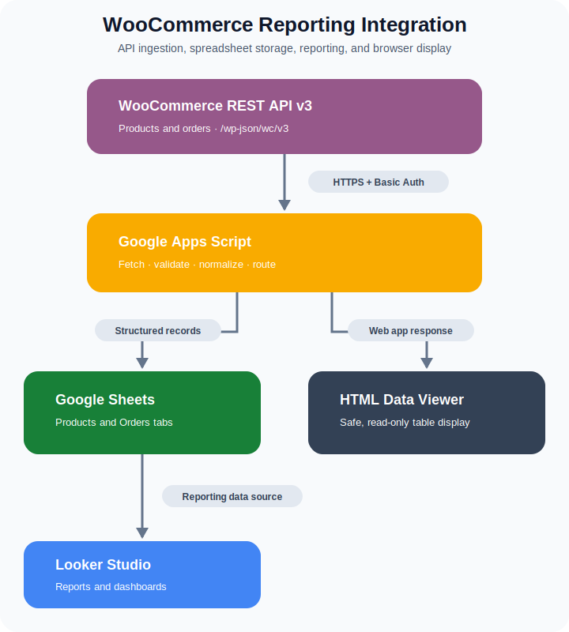

# WooCommerce to Looker Studio Integration

<p align="center">
  <a href="https://wordpress.org/documentation/"></a>
  &nbsp;&nbsp;&nbsp;
  <a href="https://woocommerce.com/document/woocommerce-rest-api/"></a>
  &nbsp;&nbsp;&nbsp;
  <a href="https://cloud.google.com/looker/docs/studio"></a>
</p>

<p align="center">
  <a href="https://github.com/zoma00/WooCommerce-Google-Looker-Studio-Integration/actions/workflows/ci.yml"></a>
  
  
  
  <a href="LICENSE"></a>
</p>

A proof-of-concept reporting workflow that retrieves product and order data from the WooCommerce REST API, writes structured records to Google Sheets, and makes the sheet available as a Looker Studio data source.

This is a Google Apps Script integration, not a WordPress plugin or a production-ready connector.

## Integration Flow

<p align="center">
  
</p>

## What It Demonstrates

- WooCommerce REST API v3 integration for products and orders
- Server-side credential retrieval from Apps Script Properties
- Authorization through an HTTP header, keeping credentials out of request URLs
- Response validation and explicit handling of non-success HTTP status codes
- Normalization of API data before it is written to separate spreadsheet tabs
- Safe browser rendering with DOM APIs and `textContent`
- Automated unit tests, ESLint, and GitHub Actions CI

## Configuration

1. Create a Google Sheet and open **Extensions > Apps Script**.
2. Copy `Code.js` into the Apps Script `Code.gs` editor file.
3. Add an HTML file named `index` and copy `index.html` into it.
4. In **Project Settings > Script Properties**, add:

   | Property | Example |
   |---|---|
   | `WOOCOMMERCE_STORE_URL` | `https://store.example.com` |
   | `WOOCOMMERCE_CONSUMER_KEY` | A read-only WooCommerce consumer key |
   | `WOOCOMMERCE_CONSUMER_SECRET` | Its matching consumer secret |

5. Run `saveWooCommerceDataToSheet` and approve the required Apps Script permissions.
6. Connect the populated Google Sheet to Looker Studio if reporting is required.

Use read-only WooCommerce credentials for this demonstration. Never commit credentials, place them directly in source code, or share them in screenshots and logs.

## Local Quality Checks

The Apps Script services are not available in Node.js, so the tests cover the portable integration logic: URL construction, endpoint validation, credential-header construction, and response-field selection.

```bash
npm ci
npm run lint
npm test
```

## Scope

The current proof of concept imports the first 100 product and order records. Production use would still require pagination, incremental synchronization, retry/backoff behavior, rate-limit handling, monitoring, and a defined data-retention policy.

## License

Licensed under the [MIT License](LICENSE).

## Author

[Hazem Adel Elbatawy](https://github.com/zoma00)
